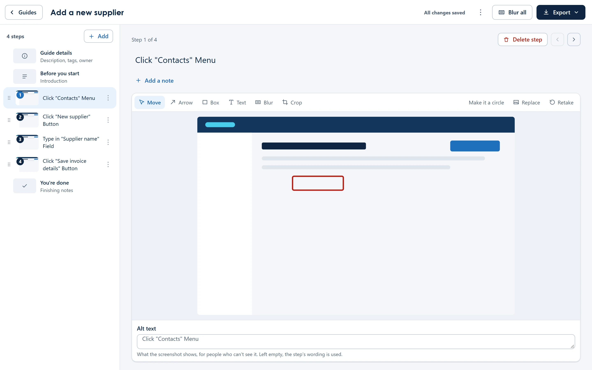

<p align="center">
  
</p>

<h1 align="center">Steps by Amluto</h1>

<p align="center">
  <strong>Do a task once. Get the guide.</strong><br />
  Steps records a task click by click and turns it into a step-by-step guide, with a screenshot for every step, ready to edit and share.
</p>

<p align="center">
  <a href="https://steps.amluto.com/">Website</a> ·
  <a href="https://github.com/amluto-solutions/steps/releases/latest">Download</a> ·
  <a href="https://steps.amluto.com/help/">Help</a> ·
  <a href="https://steps.amluto.com/it/">IT guide</a> ·
  <a href="https://buymeacoffee.com/amluto">Support Steps</a>
</p>



## What it does

You do the task as normal. Steps watches the clicks, names what you clicked ("Click **Save**", "Type in the **Supplier name** field"), and takes a screenshot of each step. When you stop, the guide is already written.

- **Edit it like a document:** reword steps, reorder them, add notes, tips and warnings, crop, draw arrows and boxes on the screenshots.
- **Keep private things private:** blur parts of a screenshot, get suggestions for names, emails and account numbers to blur, and keep whole apps or sites out of recordings. Password fields are never read.
- **In 38 languages:** the app, and the wording of every step. Pick a tone too: casual, plain language or formal. A guide can hold several languages at once.
- **Export it anywhere:** a branded PDF, a Word document, or an interactive web page that walks the reader through each step. Exports carry your own logo, colours and fonts.
- **Share a library:** keep guides in a OneDrive or SharePoint folder your team already uses. Steps handles two people editing the same guide.
- **For IT:** silent installs with the MSI, settings by Group Policy, Intune or the browser's policies, and a list of apps never recorded.

**Nothing is sent to Amluto or anyone else.** There's no account and no server: guides are files in folders you choose.

## Get Steps

| | |
|---|---|
| **Windows 11** | The setup `.exe` (no admin rights needed), a portable `.exe`, or the `.msi` for IT, from [Releases](https://github.com/amluto-solutions/steps/releases/latest) or [steps.amluto.com](https://steps.amluto.com/). Also `winget install Amluto.Steps` and the Microsoft Store, once listed. |
| **Linux (beta)** | A `.deb` and an AppImage, for X11 sessions. |
| **Chrome, Edge, Firefox** | Steps for the browser, the same app for recording in web apps, from each browser's add-on store once listed. |

Each release lists every file's SHA-256 in `SHA256SUMS.txt`.

## Support Steps

Steps is free and open source, and stays that way. If it saves you or your team time, you can **[buy us a coffee](https://buymeacoffee.com/amluto)**: it pays for the next releases, the features people ask for, and quicker fixes. To sponsor it as a company, email steps@amluto.com.

## Building it yourself

Steps is one codebase: a React interface shared by a [Tauri](https://tauri.app/) desktop app (Rust) and a browser extension ([WXT](https://wxt.dev/)).

### Windows desktop app

You need:
- Windows 11, 64-bit
- [Node.js 24](https://nodejs.org/) (npm 11 or later)
- [Rust](https://rustup.rs/) through rustup (the version is pinned in `rust-toolchain.toml` and installed for you)
- the [Visual Studio Build Tools](https://visualstudio.microsoft.com/visual-cpp-build-tools/) with "Desktop development with C++"
- WebView2, which Windows 11 already has

Then:

```bash
npm install
npm run dev                  # the app, with hot reload
npm run tauri -- build       # the setup .exe and .msi, in apps/desktop/src-tauri/target/release/bundle/
```

### Linux desktop app (beta)

On Ubuntu (tested on 26.04, also in WSL):

```bash
sudo apt install build-essential pkg-config libwebkit2gtk-4.1-dev libayatana-appindicator3-dev \
  librsvg2-dev libxdo-dev libssl-dev libxcb1-dev libxkbcommon-dev
npm install
npm run tauri -- build       # the .deb and AppImage
```

Recording needs an X11 session; Wayland isn't supported yet.

### Browser extension

Node 24 is all it needs.

```bash
npm ci
npm run build -w @amluto-steps/chrome           # Chrome and Edge: apps/chrome/.output/chrome-mv3
npm run build:firefox -w @amluto-steps/chrome   # Firefox: apps/chrome/.output/firefox-mv3
```

Load the folder in `chrome://extensions` (Developer mode, Load unpacked) or `about:debugging` in Firefox.

### Checks

```bash
npm test         # the TypeScript tests
npm run check    # everything: Prettier, ESLint, TypeScript, the tests with accessibility checks,
                 # npm audit, cargo fmt, clippy, cargo test, cargo deny and cargo audit
```

Rust's `cargo-deny` and `cargo-audit` are installed with `cargo install --locked cargo-deny cargo-audit`.

## How it's laid out

```
apps/desktop/           the desktop app: Vite entry and the Tauri crate (src-tauri/)
  src-tauri/crates/
    capture/            click pipeline, UI Automation, screenshots
    capture-win32/      the Windows layer (the only crate with unsafe code)
    capture-x11/        the Linux layer (X11 and AT-SPI)
    library/            guide folders, locking, archives
apps/chrome/            Steps for Chrome, Edge and Firefox
apps/website/           steps.amluto.com
packages/core/          the guide format, step wording and privacy rules
packages/ui/            the React interface, with the wording in 38 languages (src/locales/)
packages/export/        PDF, Word and web page exports
```

## Contributing

Bug reports and ideas are welcome as [issues](https://github.com/amluto-solutions/steps/issues). For a pull request:
- run `npm run check` first;
- keep interface text in `packages/ui/src/locales/en.json` (ESLint fails on text written into components).

Spotted a mistake in a translation? Open an issue or email steps@amluto.com. Security problems go to security@amluto.com, not an issue ([SECURITY.md](SECURITY.md)).

## About Amluto

Steps is made by [Amluto Solutions Ltd](https://amluto.com/), a UK software company that builds small, focused apps and AI-driven development for UK industry. Our client work pays the running costs; support for Steps pays for more time on it.

If Steps saves you time, **[buy us a coffee](https://buymeacoffee.com/amluto)**, or star the repository so more people find it. To sponsor Steps as a company, email steps@amluto.com.

## Licence

Steps is free software: you can share and change it under the [GNU General Public License](LICENSE), version 3 or (at your option) any later version. The names Amluto and Steps by Amluto, and their logos, aren't covered by the licence ([TRADEMARKS.md](TRADEMARKS.md)): if you share a changed version, give it your own name and icon.

The open-source components Steps uses, and their licences, are listed in the app (Settings > About) and in `THIRD-PARTY-NOTICES.txt` with each release.
